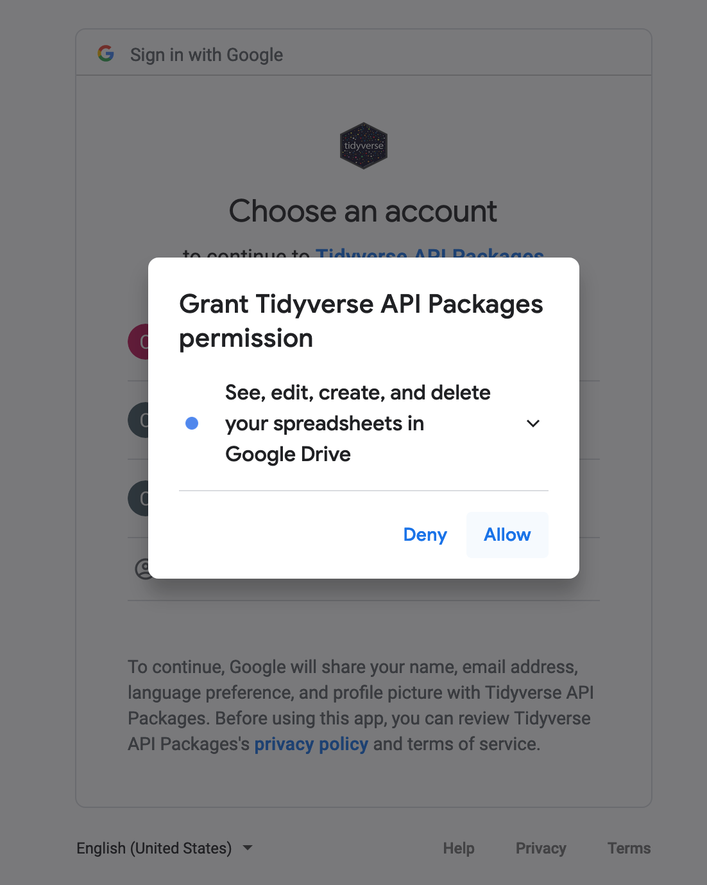
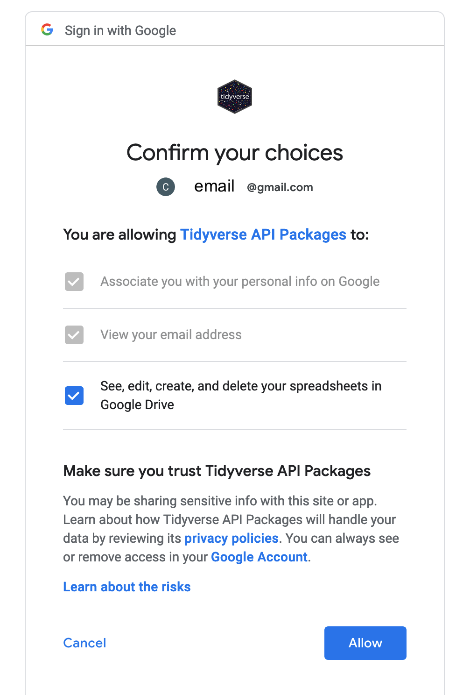
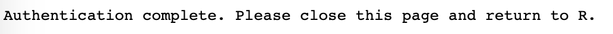

Week 1 of Project 3 (11/2 - 11/4) 
========================================================
author: Charlotte Chang
date: 2020-10-29
width: 1440
height: 900
autosize: true

Goals:

* Authenticate access to Google sheets
    + These slides will focus on ensuring that you can interact with your Google account using `googlesheets4` in `RStudio Server`
* Select an issue and platform with a clear rationale
* Begin compiling environmental social media data

Getting started
========================================================

* First, make a copy of the [Google sheet](https://docs.google.com/spreadsheets/d/1hQy8kR81GHmMDPivpyd8XzAGU7A6oUCUArq1bltm5EQ/edit?usp=sharing) in your own Google drive account. 
* You can do this using either:
    + `File -> Make a copy`  
    + or by copy-pasting the contents over to your own Google spreadsheet file.
* While I provide and use the link to the [base template spreadsheet](https://docs.google.com/spreadsheets/d/1hQy8kR81GHmMDPivpyd8XzAGU7A6oUCUArq1bltm5EQ/edit?usp=sharing), you should feel free to use the link to share access to your own copy of the base template spreadsheet. 
* You will be modifying the base template spreadsheet to store your own social media data for [Assignment 1](https://ea30-fa20.github.io/ConsSocMedia/assignments.html) (**Section 2** in document).

Authenticating Google sheets access
========================================================

Next, please run the following code in your `RStudio Server` session in the console (copy and paste these lines of code into the `Console` which always has the `>` symbol to take in a command).

`library(googlesheets4)`

Potential warning messages and a bit of background on R syntax
========================================================

Running the command `library(googlesheets4)` may or may not generate some messages, such as ` Warning message: replacing previous import ‘vctrs::data_frame’ by ‘tibble::data_frame’ when loading ‘dplyr’ `. 

Don't worry about that; in this message, it is simply warning you that by loading `googlesheets4` into your workspace, you are overriding the command `data_frame` from the package `vctrs` with the command `data_frame` from the (`tidyverse`) package `tibble`. 

Note that the double colons (`::`) in `tibble::data_frame` represent the syntax for calling a function (`data_frame`) from a specific package (`tibble`). This `::` convention is one way to ensure that you call in a specific function from a specific package, which is very helpful if you are dealing with multiple packages that have functions that have *the same name*.

Initial interaction with Google sheets API in R
========================================================

Then, the first time you interact with a Google sheet using the `googlesheets4` Application Programming Interface (API) wrapper, it will ask you about permissions to store your credentials. This will permit you to easily access your Google account and the spreadsheet we'll be making for this project in the future from your `RStudio Server` workspace. 

```
options(gargle_oob_default = TRUE) # this sets up an option for you to authenticate in your local browser rather than through the RStudio Server, which does not permit certain communication protocols; if you run this locally, you do not need to include this line
enviro_soc_media_DF <- googlesheets4::read_sheet("https://docs.google.com/spreadsheets/d/1hQy8kR81GHmMDPivpyd8XzAGU7A6oUCUArq1bltm5EQ/edit?usp=sharing")
```

Note that we are storing the data from the Google sheet into a variable called `enviro_soc_media_DF`, short for "environmental social media `data.frame`". (You will want to replace the link here with the `sharing` link for your own Google sheet eventually.)

========================================================
At the same time, another tab will open in your internet browser on your computer, displaying a window that asks you to select which of your Google account(s) to grant access to in `RStudio Server` using the `googlesheets4` package.



========================================================
Select `Allow`. Next, you will see:



========================================================
Select `Allow` again. This will produce an authorization code that you will then copy and paste into your `RStudio Server` session. You can copy the code by pressing the <svg style="height:0.8em;top:.04em;position:relative;" viewBox="0 0 448 512"><path d="M320 448v40c0 13.255-10.745 24-24 24H24c-13.255 0-24-10.745-24-24V120c0-13.255 10.745-24 24-24h72v296c0 30.879 25.121 56 56 56h168zm0-344V0H152c-13.255 0-24 10.745-24 24v368c0 13.255 10.745 24 24 24h272c13.255 0 24-10.745 24-24V128H344c-13.2 0-24-10.8-24-24zm120.971-31.029L375.029 7.029A24 24 0 0 0 358.059 0H352v96h96v-6.059a24 24 0 0 0-7.029-16.97z"/></svg> button to the right of the authentication code.


========================================================
Next, navigate back to the internet browser tab running `RStudio Server`. You will paste the code in response to the `Enter authorization code` prompt waiting in the console.


Copy the authorization code into the blank space next to `Enter authorization code`.

========================================================
Once you paste the code in, you will see this type of successful response, showing you that the authentication has worked and the `read_sheet` function `googlesheets4` will return:


Success!
========================================================
Great work! You have successfully authenticated access to your Google account in your `RStudio Server` user workspace.

Going forward, even if you switch sessions, restart your session, or open a new session in `RStudio Server`, you shouldn't need to re-authenticate access to Google. Instead, your credentials will be stored in a cached file.

Let's say that you run code to read in the data for this project's sample dataset, which is a different Google sheet. We'll store that Google sheet in to a variable called `envDF` (environmental `data.frame`).

`envDF <- googlesheets4::read_sheet("https://docs.google.com/spreadsheets/d/1K-tgni6JJ33x1mG-rxNFopnC8sBuRzVLd5loBO0e1jk/edit?usp=sharing")`

Repeat access to your Google credentials after initial authentication
========================================================
Once you use `read_sheets` from `googlesheets4` to read a different spreadsheet (e.g. your own spreadsheet where you will be compiling environmental social media data), you'll see a prompt asking you to select which account to use. If the first account listed is correct, then just type `1` next to the `Selection` query in the console.


Viewing Google sheets in R
========================================================

After you have pulled your or the sample Google sheet into your `R` workspace using `googlesheets4::read_sheets`, you'll notice that the data looks, perhaps, different than the `data.frame`s we have interacted with so far in this class.

For instance calling `head()` (print first 6 rows) on the `envDF` (sample text Google sheet) that we read into the workspace in the previous slides yields:


Viewing Google sheets in R
========================================================

`head(envDF)` tells us that the data is a `tibble`. What is that? A `tibble` is simply the [Tidyverse packages' re-implementation of base R `data.frame`](https://tibble.tidyverse.org/). 

So, the TL;DR is that you can interact with `envDF` just the same as the `data.frame`s you have created in Projects 1 and 2 for EA30.

The nice thing about `tibble`s though is that they are more selective about printing fields (so it won't overwhelm your console if you have a spreadsheet with a ton of rows and/or columns), and it defaults to printing the data type in each column, e.g. `<chr>` - character (string data like "apple", "toucan", "sagehen"), `<dbl>` - numeric variable that is a float (has decimal points), not an integer ([FMI on R data types here](https://www.diegobarneche.com/2014-12-11-ufsc/lessons/01-intro_r/data-structures.html)).

Interacting with Google sheets in R
========================================================
The sample dataset (`envDF`, [link here](https://docs.google.com/spreadsheets/d/1K-tgni6JJ33x1mG-rxNFopnC8sBuRzVLd5loBO0e1jk/edit?usp=sharing)) has these columns:

<font size="6.5">
**Columns that must be included**:
* Site: Which social media site (platform) was the source of each post (datum)?
  + Here, all of the data came from Twitter.
* Issue: What is the environmental issue discussed in the post?
* PostLink: The link to each post (**very important to include** for reproducibility/data integrity)
* Text: The author's (text) message written in their post.

**Optional columns**:
***
* Followers: The number of followers that each post author had when I found and copied their post data into the Google sheet.
* RTs, Likes: These are columns presenting the number of retweets (`RTs`) and favorites (`Likes`) for each post.
* ImageLink: Link to any image or videos embedded in the post (NB: Some platforms make this impossible/very difficult to access (e.g. Facebook/IG) by hiding these links behind an interactive `JavaScript` function.)
* ImageDescription: My own description of the image
* Notes: My notes about the post, such as if it was a quote tweet
* SecondaryThemes: Any other environmental topics that were also present in the post
</font>

(Slightly) modified authentication steps for useRs using local computer instead of RStudio Server
========================================================
If you plan to run this project on your own computer instead of using `RStudio Server` (**not recommended and will not generally be supported with any further assistance**), note that the workflow for authentication involves a few different steps, which you will see on the next two slides.

However, if you are going to use `RStudio Server`, you have completed the task of authenticating access to your Google account so that you can analyze your social media data. Congratulations!

Slight modifications to authentication workflow if you are running R locally:
========================================================
**This step only happens if you are running this code in `R` or `RStudio` on your machine (not `RStudio Server`).** In the console, you will then see:

```
Is it OK to cache OAuth access credentials in the folder '/Users/cecilsagehen4747/.R/gargle/gargle-oauth' between R sessions?

1: Yes
2: No

Selection:
```

Please make sure that you **type `1`** (**`Yes`**). The console will then print:
```
Waiting for authentication in browser...
Press Esc/Ctrl + C to abort
```

Continued modified steps for local useRs
========================================================
After the authentication step where you have selected `Allow` in the `Grant Tidyverse API Packages permission` window, please ensure that you have selected the checkmark next to 

`See, edit,create, and delete your spreadsheets in Google Drive`. 

Then click `Allow`. 

You should then see this message:



